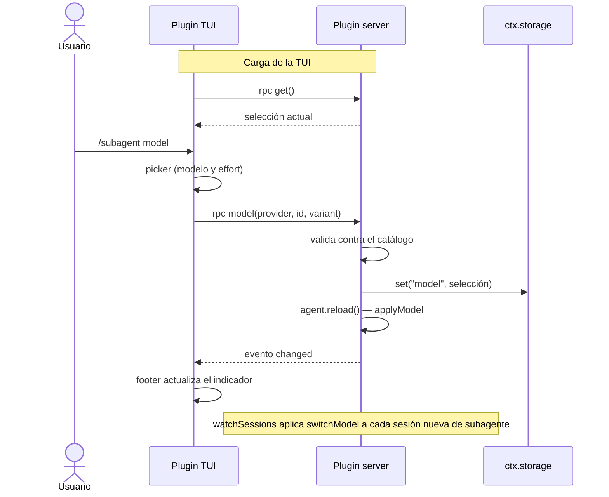

# Subagent

Subagent es un plugin de OpenCode V2 que permite elegir el modelo que usan los subagentes de forma
dinámica, con el comando `/subagent`.

## Uso

```
/subagent model                              Picker de modelo y effort
/subagent model <provider/model[#variant]>   Selección directa
/subagent clear                              Limpia la selección
```

Con selección activa, el footer del prompt muestra `subagent: provider/model#variant`.

## Cómo funciona

El paquete define dos plugins sobre un mismo contrato RPC:

- **Plugin TUI**: corre en el cliente.
  Registra el comando `/subagent`, los diálogos de selección y el indicador del footer.
- **Plugin server**: corre junto al server de OpenCode.
  Registra los métodos RPC, persiste la selección en `ctx.storage` (clave `model`) y la aplica a los
  agentes y sesiones.

El server es la fuente de verdad. La TUI mantiene un espejo efímero en memoria
(`context.storage.memory`) que se siembra una vez con el método `get` y se mantiene actualizado con
el evento `changed`.



## Desarrollo

```sh
bunx tsc --noEmit --strict --module nodenext --moduleResolution nodenext \
  --target esnext --jsx preserve --skipLibCheck index.ts tui.tsx
```

> Referencias:
>
> - [RPC guide](https://opencode.ai/v2/docs/build/plugins/rpc)
> - [CLI plugin](https://opencode.ai/v2/docs/build/plugins/cli)
> - [Plugins](https://opencode.ai/v2/docs/build/plugins)
