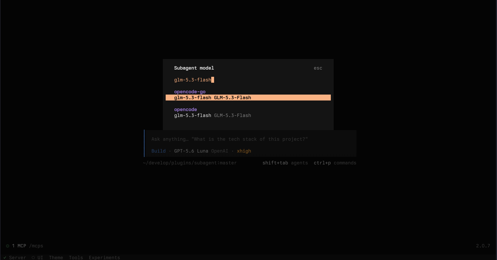
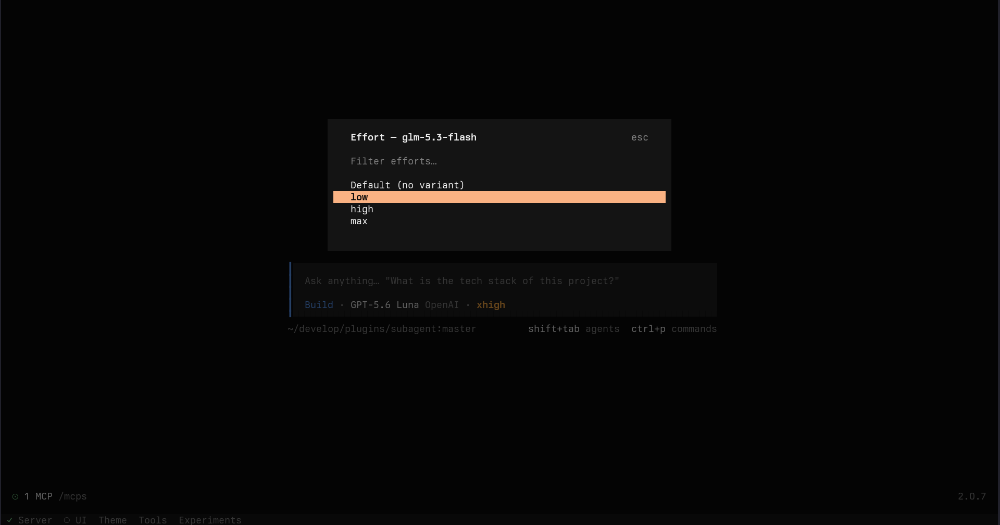
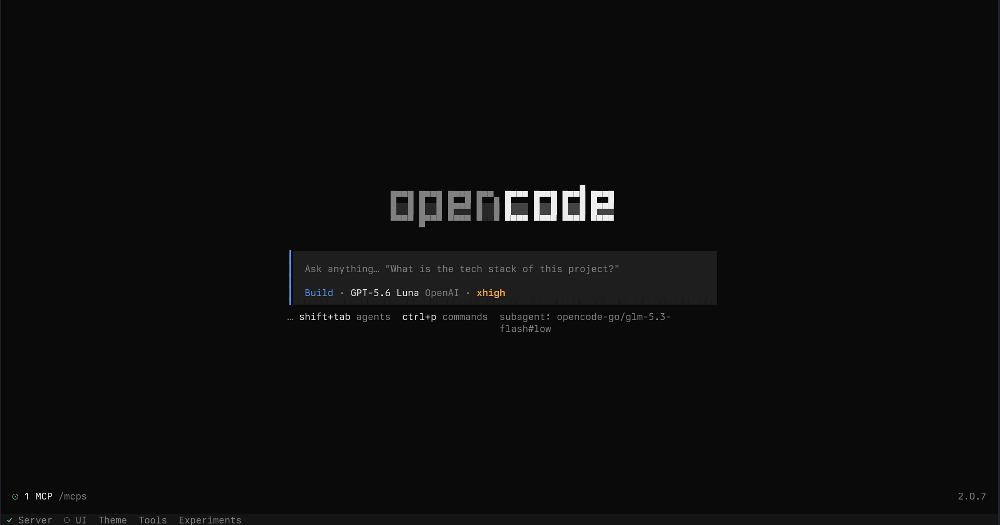
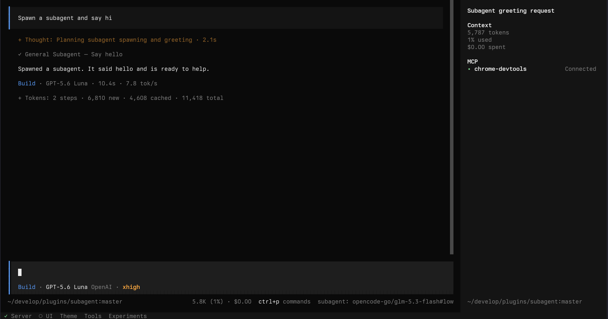
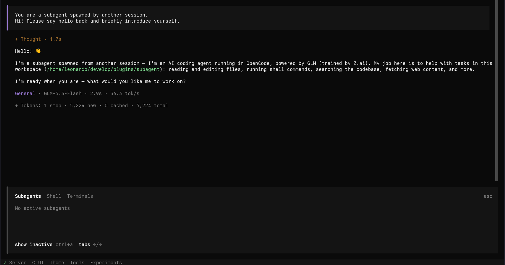
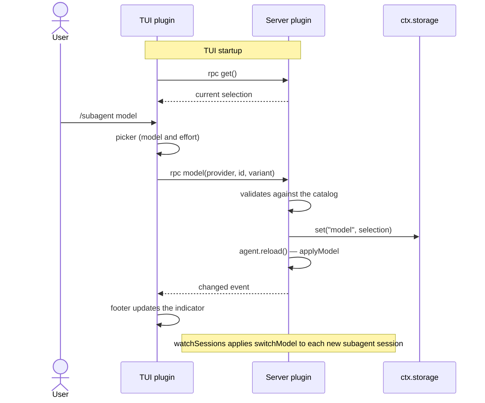

# Subagent

Subagent is an OpenCode V2 plugin that lets you dynamically choose the model used by subagents with
the `/subagent` command.

## Usage

```
/subagent model                              Model and effort picker
/subagent model <provider/model[#variant]>   Direct selection
/subagent clear                              Clears the selection
```

When a selection is active, the prompt footer displays `subagent: provider/model#variant`.

## Showcase

Select a model from the catalog:



Choose the subagent effort:



The active model and effort are shown in the prompt footer:



The main session can use a different model from its subagent:



Entering the subagent session shows the selected model in its response:



## How it works

The package defines two plugins over the same RPC contract:

- **TUI plugin**: runs in the client.
  Registers the `/subagent` command, selection dialogs, and the footer indicator.
- **Server plugin**: runs alongside the OpenCode server.
  Registers the RPC methods, persists the selection in `ctx.storage` (key `model`), and applies it to
  agents and sessions.

The server is the source of truth. The TUI maintains an ephemeral in-memory mirror
(`context.storage.memory`) that is seeded once with the `get` method and kept up to date by the
`changed` event.



## Development

```sh
bunx tsc --noEmit --strict --module nodenext --moduleResolution nodenext \
  --target esnext --jsx preserve --skipLibCheck index.ts tui.tsx
```

> References:
>
> - [RPC guide](https://opencode.ai/v2/docs/build/plugins/rpc)
> - [CLI plugin](https://opencode.ai/v2/docs/build/plugins/cli)
> - [Plugins](https://opencode.ai/v2/docs/build/plugins)
